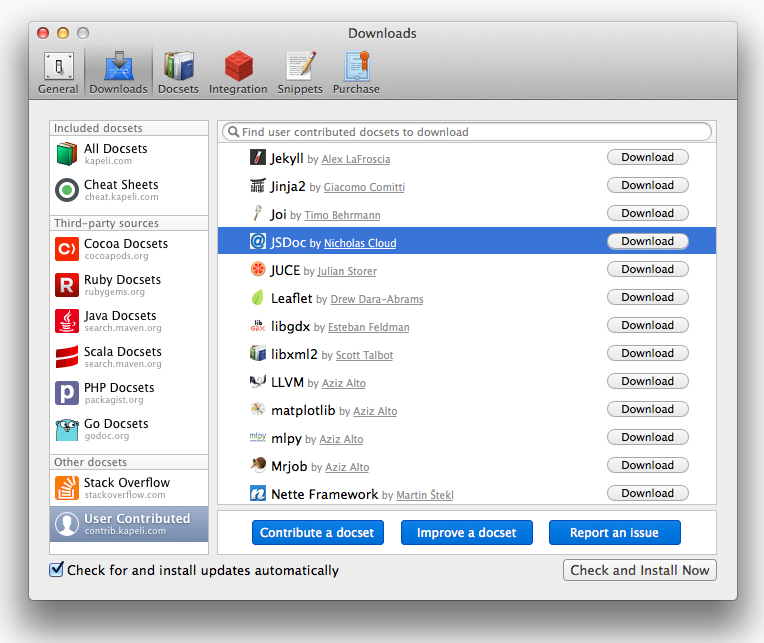

# JSDoc for Dash

Creates a [jsdoc3](https://github.com/jsdoc3/jsdoc3.github.com) docset for the source documentation browser, [Dash](http://kapeli.com/).

## Building

The current JSDoc docset is in the `build` directory. To rebuild the documentation:

- `> npm install`
- `> jake build`

This will pull the current `master` branch from the [JSDoc documentation](http://usejsdoc.org/) repository into a `.tmp` directory and parse the source files to rebuild the docset.

## Installing

### From contrib.kapeli.com

The JSDoc docset is now part of the Dash User Contributed docsets.

1. Open Dash.
2. Go to `Dash -> Preferences -> Downloads`.
3. Click the "download" button next to the JSDoc entry.

This is the recommended installation method.

### From the JSDoc docset feed

1. Open Dash.
2. Go to `Dash -> Preferences -> Downloads` and click the `+` icon (Add docset feed) in the lower-left of the dialog.
3. Enter the feed URL: `https://raw.github.com/nicholascloud/jsdoc3-dash/master/feeds/JSDoc.xml`.
4. Click the `Install` button when the docset appears in the dialog.

When the docset is updated, the version number in the feed file will be incremented and you will receive the update automatically.

### From github sources

Make sure Dash is installed and double-click on `build/jsdoc.docset` in Finder.

Alternatively:

1. Open Dash.
2. Go to `Dash -> Preferences -> Docsets` and click the `+` icon (Add Docset) in the lower-left of the dialog.
3. Navigate to the project `build` directory.
4. Choose the `jsdoc.docset` directory to include in your Dash docsets.